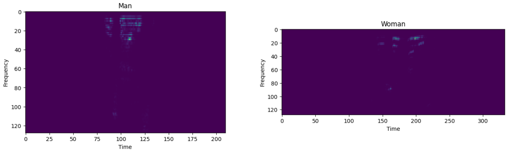

This repo contains simple CNN-based solution for classifying the gender of the speaker. (99%+ accuracy)

Use `python train.py -n "your_exp_name"` to reproduce results.
Check `MakeDataset.py` to adjust data processing if necessary.
Check `train.py` to set up experiment settings.

Check `pipeline.ipynb` to use inference tool and to see some more related details.

